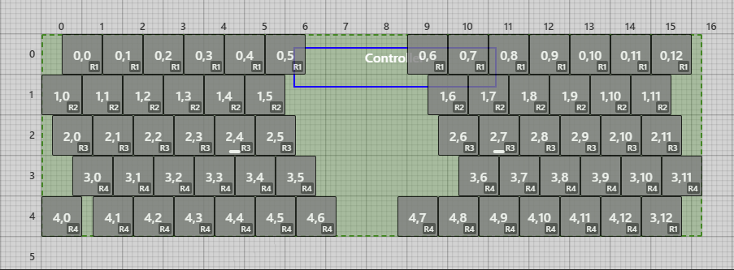
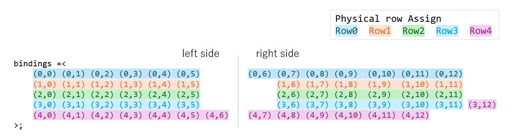

# moder63

Generated by [Auto-Keyboard-Design-Kit](https://auto-kdk.pages.dev/)

## Preview

- 3D View

- Top View

## Parts List

|Part|Quantity|
|---|---|
|wireless controller|1|
|Conthrough(2.5mm, 9pin)|2|
|Battery|1|
USB-C cable|1|
|Choc V2 switch and Choc socket|63|
|Diode|63|
|Keycap|63|

## Module configuration

- Module Configuration

- Keymap
  - Please note that key(3, 12) is an irregular placement.

## Bluetooth connection

You can switch the Bluetooth connection target using `bt BT_SEL #` (where # is 0 to 4).
Please check which keys `bt BT_SEL #` are assigned to.

Default assignments are as follow.

|bt BT_SEL #|default key assign|
|---|---|
|bt BT_SEL 0|key(0,0) on Layer3|
|bt BT_SEL 1|key(0,1) on Layer3|
|bt BT_SEL 2|key(0,2) on Layer3|
|bt BT_SEL 3|key(0,3) on Layer3|
|bt BT_SEL 4|key(0,4) on Layer3|
